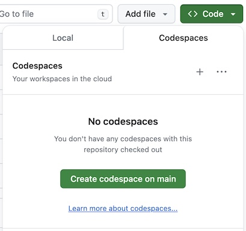

# UnionAI Serverless Devcontainer Template

## Codespaces on GitHub

1. Go to [serverless-gcp.cloud-staging.union.ai](https://serverless-gcp.cloud-staging.union.ai/) and login with your GitHub account.
2. Fork this repo and navigate to your fork.
3. Click on the Code button, go to the Codespaces tab, click on "Create codespaces on main".



4. Open a terminal window in the Codespaces environment.
5. Authenticate with UnionAI by running `unionai create login device-flow`. Go to the link provided and place in the code.

```bash
> unionai create login device-flow
To Authenticate, navigate in a browser to the following URL:
https://signin.cloud-staging.union.ai/activate and enter code: CODE_IS_HERE
```
6. To check that everything works run `unionai run --remote hello.py main`:

```bash
> unionai run --remote hello.py main
Running Execution on Remote.

[✔] Go to https://serverless-gcp.cloud-staging.union.ai/org/USERNAME/projects/default/domains/development/executions/EXECUTION_ID
to see execution in the console.
```

